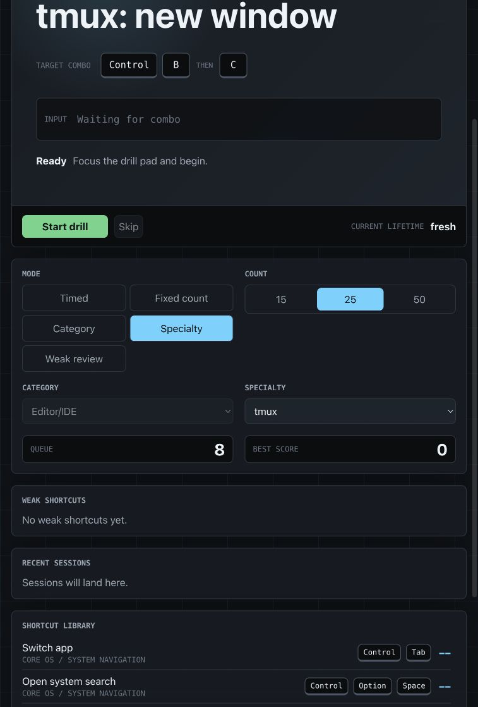

# Shortcutype

**Build shortcut reflexes like you build typing speed.**

Shortcutype is a fast, keyboard-first trainer for developer shortcuts across macOS, Windows, tmux, Vim, Emacs, VS Code, browser DevTools, shell workflows, and Git muscle memory.

If you have ever bookmarked a shortcut cheat sheet and still reached for the mouse five minutes later, this is for you.



## Why Shortcutype?

Most shortcut tools are static cheat sheets. Shortcutype is a drill surface.

It shows one action at a time, listens for the real key combination, gives immediate feedback, and keeps the rhythm moving. Think Monkeytype, but for the commands developers actually use all day.

## Highlights

- **Real practice loop**: timed sessions, fixed-count drills, category drills, specialty drills, and weak-shortcut review.
- **Developer-first shortcut sets**: macOS, Windows, shell/readline, tmux, Vim, Emacs, VS Code, DevTools, Git, Finder/File Explorer, and system navigation.
- **Multi-step sequence support**: train commands like `Ctrl+B then C`, `D then D`, `G then G`, and `Ctrl+X then Ctrl+S`.
- **Immediate feedback**: correct, wrong key, close-but-wrong modifier, skipped, and partial sequence states.
- **Progress that sticks**: recent sessions, per-shortcut accuracy, weak shortcuts, best streak, and best score are saved locally.
- **Browser-safe capture**: OS-owned shortcuts use safe simulated drill combos while still showing the real shortcut.
- **Focused interface**: dense stats, large prompt, clear key visualization, dark/light themes, no landing-page fluff.

## Practice modes

| Mode | Use it for |
| --- | --- |
| Timed | Build rhythm in 30s, 60s, or 120s bursts |
| Fixed count | Finish a clean set of 15, 25, or 50 prompts |
| Category | Drill a surface like Terminal, DevTools, or Editor/IDE |
| Specialty | Go deep on tmux, Vim, Emacs, VS Code, Git, and more |
| Weak review | Revisit shortcuts your hands keep missing |

## Specialty packs

Shortcutype ships with realistic seed sets for:

- Core OS navigation
- Shell / Readline
- tmux
- Vim
- Emacs
- VS Code
- Browser DevTools
- Git workflow

The data is intentionally simple to extend. Add shortcuts in `src/shortcuts.ts` instead of wiring new conditionals into the app.

```ts
{
  action: 'tmux: new window',
  keys: combo(['control'], 'b'),
  sequence: [combo(['control'], 'b'), combo([], 'c')],
}
```

## Quick start

```bash
npm install
npm run dev
```

Open:

```text
http://127.0.0.1:5173/
```

## Quality checks

```bash
npm run lint
npm run build
npm audit --audit-level=moderate
```

## Local-first progress

Shortcutype stores progress in browser `localStorage` under:

```text
shortcutype-progress-v1
```

No account, no backend, no telemetry pipeline. Just drills and your local progress.

## Browser capture limits

Some operating-system shortcuts cannot be reliably captured by a web page. Examples include macOS `Cmd + Tab`, macOS `Cmd + Space`, and Windows `Alt + Tab`.

For those shortcuts, Shortcutype stores the real combo and uses a browser-safe drill combo so the session does not break or hijack your OS.

## Roadmap ideas

- Import/export shortcut packs
- User-created packs
- Daily streaks
- GitHub Pages demo
- Chord timing metrics for multi-step shortcuts
- Optional sound and haptics

## Star it

If Shortcutype helps your hands get faster, a star helps other developers find it.
