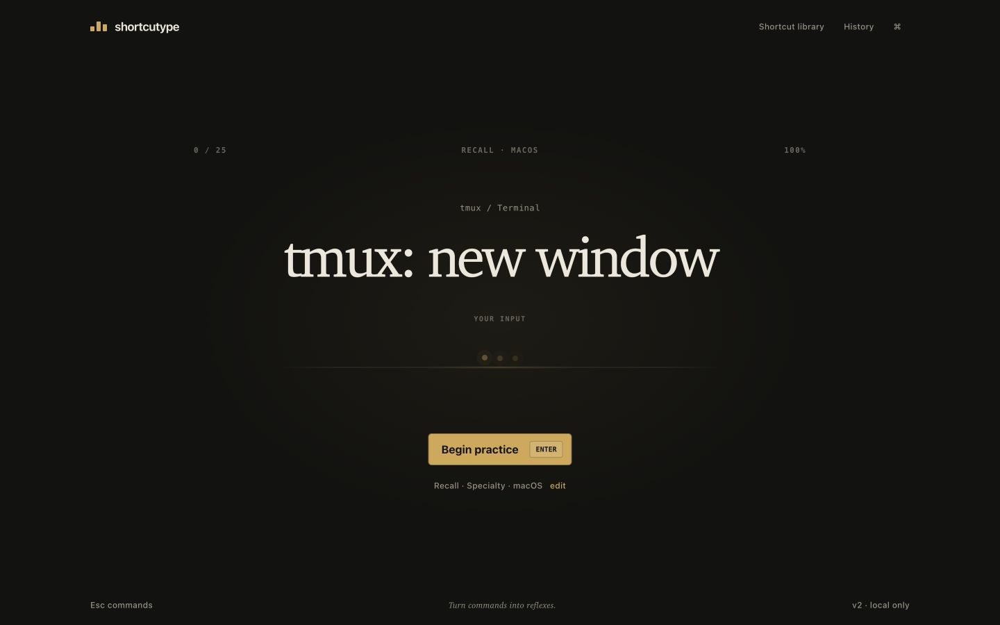

# Shortcutype

[English](../README.md) | [简体中文](README.zh-CN.md)

**把命令练成下意识。**

Shortcutype 是面向开发者快捷键的键盘优先回忆训练器。它给出真实工作动作、隐藏答案、捕获实际按键组合，并立即安排下一次有价值的回忆。所有数据只保存在本机：无账号、无后端、无分析和遥测。



## 训练循环

Shortcutype 不是快捷键速查表。默认的**回忆模式**不会提前展示目标组合；输入会沿 Chord Trace 形成一条短暂信号轨迹，错误会明确指出是主键不对，还是修饰键组合不对。

- 在准备页按 `Enter` 开始。
- 输入快捷键作答；多段组合会逐步确认，不提前泄露后续答案。
- 按 `F1` 显示答案；看过答案的作答会标为辅助完成且不计分。
- 按 `Ctrl + →` 跳过。
- 按 `Esc` 或 `Ctrl/Cmd + Shift + P` 打开命令面板；面板打开期间计时暂停。
- 在结果页按 `Enter` 原配置重练，也可按 `Tab` 再按 `Enter` 明确快速重开。

从开始、训练、暂停/调整、结束、复盘到重开，全流程均可不碰鼠标完成。

## 模式和训练范围

- 固定数量：10、25 或 50 次回忆。
- 限时训练：30、60 或 120 秒。
- 分类训练：系统、文本、终端、浏览器/开发者工具、编辑器、文件或工作流。
- 专项训练：核心系统、Readline、tmux、Vim、Emacs、VS Code、DevTools 或 Git。
- 弱项复习：至少完成两次计分尝试且准确率低于 80% 的快捷键。
- 学习模式：初次接触时持续展示答案，熟悉后再切换到回忆模式。

自适应调度会提高新题、弱项和到期题目的权重，同时避免连续重复。题目上方的小标签会解释它为何再次出现。

## 诚实处理浏览器限制

macOS `Cmd + Tab`、`Cmd + Space` 和 Windows `Alt + Tab` 等快捷键由操作系统接管，浏览器无法可靠捕获。

Shortcutype 默认排除这些题目。你可以将它们作为**不计分的系统卡片**加入：界面始终展示真实快捷键，要求在浏览器外实际练习，再用 `Enter` 确认。浏览器安全替代组合绝不会伪装成真实肌肉记忆训练。

## 结果与本地进度

结果页包括计分准确率、每分钟回忆、最佳连续、训练时长、准确率节奏图和逐题记录。错误、接近、跳过和看过答案的题目可以组成一个专门重练集合。

本地数据保存在：

```text
shortcutype-progress-v2
shortcutype-settings-v2
```

旧的 `shortcutype-progress-v1` 和 `shortcutype-settings-v1` 会自动迁移；损坏数据会安全回退，不会阻塞应用。

## 无障碍与显示

- 英文和简体中文。
- 深色与浅色主题。
- 清晰的键盘焦点、语义化对话框和控件。
- 正确、错误、接近、跳过和辅助完成均有非颜色文字反馈。
- 支持 `prefers-reduced-motion`，并提供应用内动效开关。
- 训练以桌面实体键盘为主；移动端仍可浏览快捷键和结果，并明确提示实体键盘要求。

## 本地开发

```bash
npm install
npm run dev
```

质量检查：

```bash
npm test
npm run lint
npm run build
npm audit --audit-level=moderate
```

Vitest 与 Testing Library 已覆盖输入解析、多段序列、别名、自适应调度、v1→v2 迁移、计时边界、命令面板和键盘会话状态流。

## 视觉验证

真实浏览器审查过的关键状态保存在 [`docs/screenshots`](screenshots)：准备、专注训练、多段序列、错误、命令面板、结果、浅色主题和移动端。

Shortcutype 借鉴优秀打字工具“专注、即时”的原则，但交互模型、视觉系统、Chord Trace、调度机制和代码实现均为独立原创。
